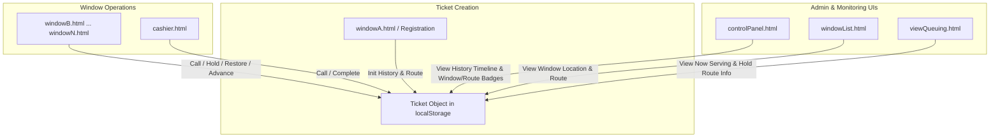

# System-Wide Action History & Current Window/Route Tracking Implementation Plan

> **For agentic workers:** REQUIRED SUB-SKILL: Use superpowers:subagent-driven-development to implement this plan task-by-task. Steps use checkbox (`- [ ]`) syntax for tracking.

**Goal:** Implement full lifecycle history logging (created, called, recalled, on hold, restored, advanced, transferred, completed) and real-time window/route tracking for all tickets across the entire system.

**Architecture:** A standardized ticket tracking model (`history` array, `currentWindow`, `currentRoute`, `heldByWindow`) initialized at ticket creation in `windowA.html` and updated across all window dashboard operations (`windowB.html`..`windowN.html`, `cashier.html`) and Control Panel actions (`controlPanel.html`). Displayed via rich UI components in Control Panel, Window List, and View Queuing screens.

**Architecture Diagram:**


**Tech Stack:** Vanilla JavaScript (ES6 / ES5 browser compatible), HTML5, CSS3.

## Global Constraints
- Browser compatibility: Standard Vanilla JS with `localStorage` persistence.
- Backward compatibility: Fallback gracefully for older ticket records lacking new metadata fields.
- Preserved Keys: `lto_ticket_queue`, `lto_onhold_queue`, `lto_accomplished_queue`.

---

### Task 1: Initialize History & Route Info in Ticket Creation (`windowA.html`)

**Files:**
- Modify: `windowA.html:554-569`

**Interfaces:**
- Consumes: Ticket registration inputs (`ticketNum`, `rawPurpose`, `type`).
- Produces: `ticketObj` with `history`, `currentWindow`, `currentRoute`, and `currentSection`.

- [ ] **Step 1: Update ticket object creation in `windowA.html`**

Update `windowA.html` lines 554-569 to calculate human-readable route info and initialize `history`:

```diff
             // === Save ticket object to shared localStorage queue ===
+            let routeDesc = 'Section B/C (LETAS)';
+            if (initialSection === 'D_E') routeDesc = 'Section D/E (Misc)';
+            else if (initialSection === 'E_J') routeDesc = 'Section E-J (Renewal/Other)';
+
             const ticketObj = {
                 id: ticketNum,
                 name: document.getElementById('ticket-info-name').textContent,
                 date: document.getElementById('ticket-info-date').textContent,
                 time: document.getElementById('ticket-info-time').textContent,
                 type: document.getElementById('ticket-info-type').textContent,
                 purpose: rawPurpose,
                 comment: document.getElementById('ticket-info-comment').textContent || '',
                 status: 'pending',
                 currentSection: initialSection,
+                currentWindow: 'Window A (Registration)',
+                currentRoute: routeDesc,
+                history: [
+                    {
+                        time: new Date().toLocaleTimeString('en-US', { hour12: false, hour: '2-digit', minute: '2-digit', second: '2-digit' }),
+                        action: 'CREATED',
+                        window: 'Window A (Registration)',
+                        desc: 'Created at Window A (Registration). Initial Route: ' + routeDesc
+                    }
+                ],
                 printedAt: Date.now()
             };
```

- [ ] **Step 2: Manual verification of ticket initialization**

Open `windowA.html` in browser, generate a test ticket, inspect `localStorage.getItem('lto_ticket_queue')` in developer tools console to confirm `history`, `currentWindow`, and `currentRoute` exist.

- [ ] **Step 3: Commit changes**

```bash
git add windowA.html
git commit -m "feat: initialize history and route info on ticket creation in windowA.html"
```

---

### Task 2: Standardize History & Location Updates across Window Dashboards (`windowB.html` ... `windowN.html` & `cashier.html`)

**Files:**
- Modify: `windowB.html`, `windowC.html`, `windowD.html`, `windowE.html`, `windowF.html`, `windowG.html`, `windowH.html`, `windowI.html`, `windowJ.html`, `windowM.html`, `windowN.html`, `cashier.html`

**Interfaces:**
- Consumes: Window calling, hold, restore, prioritize, advance, complete events.
- Produces: Updated ticket records in `localStorage` with `history`, `currentWindow`, `heldByWindow`.

- [ ] **Step 1: Enhance `_addHistory` and window action methods in `windowB.html`**

Update `_addHistory` helper in `windowB.html` to accept structured fields `(ticket, desc, action)`:

```javascript
function _addHistory(ticket, desc, action) {
    if (!ticket) return;
    if (!ticket.history) ticket.history = [];
    var now = new Date();
    var ts = now.toLocaleTimeString('en-US', { hour12: false, hour: '2-digit', minute: '2-digit', second: '2-digit' });
    ticket.history.push({
        time: ts,
        action: action || 'INFO',
        window: _winLabel(),
        desc: desc
    });
}
```

Update action calls in `windowB.html`:
- Calling next/specific: `_addHistory(next, 'Called at ' + _winLabel(), 'CALLED'); next.currentWindow = _winLabel();`
- Re-calling: `_addHistory(currentCalling, 'Re-called at ' + _winLabel(), 'RECALLED');`
- Cancel call: `_addHistory(ticket, 'Call cancelled at ' + _winLabel() + ', returned to queue', 'CANCEL_CALL'); ticket.currentWindow = 'Queue for ' + WINDOW_SECTION;`
- Put on Hold (`putOnHold()` and `mToHold()`): `_addHistory(ticket, 'Put on hold at ' + _winLabel(), 'ON_HOLD'); ticket.heldByWindow = _winLabel(); ticket.currentWindow = 'On Hold at ' + _winLabel();`
- Restore to Waiting (`mToWait()`): `_addHistory(ticket, 'Restored from hold at ' + _winLabel() + ' to pending queue', 'RESTORED'); ticket.currentWindow = 'Queue for ' + WINDOW_SECTION;`
- Make First / Make Next (`mMakeFirst()`, `mMakeNextToBeCalled()`): `_addHistory(t, 'Moved to top of queue at ' + _winLabel(), 'PRIORITIZED');`
- Proceed / Advance (`advanceTicket()`): `_addHistory(ticket, 'Advanced from ' + _winLabel() + ' to ' + nextSec, 'ADVANCED'); ticket.currentWindow = 'Queue for ' + nextSec; ticket.currentSection = nextSec;`
- Complete (`advanceTicket()` when nextSec is Complete): `_addHistory(ticket, 'Completed transaction at ' + _winLabel(), 'COMPLETED'); ticket.currentWindow = _winLabel() + ' (Completed)';`

- [ ] **Step 2: Propagate history & location updates across all remaining window JS files**

Apply the standardized `_addHistory` and ticket metadata updates to:
`windowC.html`, `windowD.html`, `windowE.html`, `windowF.html`, `windowG.html`, `windowH.html`, `windowI.html`, `windowJ.html`, `windowM.html`, `windowN.html`, and `cashier.html`.

- [ ] **Step 3: Commit changes**

```bash
git add windowB.html windowC.html windowD.html windowE.html windowF.html windowG.html windowH.html windowI.html windowJ.html windowM.html windowN.html cashier.html
git commit -m "feat: standardize history logging and window location updates across all window dashboards"
```

---

### Task 3: Control Panel Details Panel & Action Logging (`controlPanel.html`)

**Files:**
- Modify: `controlPanel.html:340-360`, `controlPanel.html:910-955`, `controlPanel.html:1050-1120`
- Modify: `style.css` (History badges and timeline styling)

**Interfaces:**
- Consumes: Ticket object history array, `currentWindow`, `currentRoute`.
- Produces: Control Panel detail UI with Location Badges, Route Tags, Action History timeline, and Control Panel action logs.

- [ ] **Step 1: Add Current Location & Route Badges to Control Panel Detail Panel in `controlPanel.html`**

Update `controlPanel.html` ticket details section to include:
```html
<div class="cp-detail-group">
    <div class="cp-detail-row">
        <span class="cp-dlabel">CURRENT WINDOW:</span>
        <span class="cp-dval" id="det-current-window" style="font-weight:700; color:#0052FF;">—</span>
    </div>
    <div class="cp-detail-row">
        <span class="cp-dlabel">ROUTE FLOW:</span>
        <span class="cp-dval" id="det-current-route" style="font-weight:600; color:#555;">—</span>
    </div>
</div>
```

- [ ] **Step 2: Update `selectTicket()` in `controlPanel.html` to populate Window, Route, and Action Badges**

In `selectTicket(t)`:
```javascript
document.getElementById('det-current-window').textContent = t.currentWindow || getCurrentWindowLabel(t);
document.getElementById('det-current-route').textContent = t.currentRoute || (t.purpose + ' Route');

var histList = document.getElementById('det-history-list');
histList.innerHTML = '';
var history = t.history || [];
if (history.length === 0) {
    histList.innerHTML = '<div class="cp-history-item"><span class="cp-history-desc">No history recorded</span></div>';
} else {
    history.forEach(function(h) {
        var hRow = document.createElement('div');
        hRow.className = 'cp-history-item';
        var actionTag = h.action ? '<span class="cp-action-tag cp-act-' + (h.action || 'info').toLowerCase() + '">' + h.action + '</span>' : '';
        hRow.innerHTML = '<span class="cp-history-time">' + (h.time || '') + '</span>' + actionTag + '<span class="cp-history-desc">' + (h.desc || '') + '</span>';
        histList.appendChild(hRow);
    });
}
```

- [ ] **Step 3: Update Control Panel Action Handlers (Complete, Transfer, Delete) to log structured history**

In `controlPanel.html`:
```javascript
// Complete
addHistoryEntry(ticket, 'Bypassed & Marked Completed via Control Panel', 'COMPLETED');
ticket.currentWindow = 'Control Panel (Completed)';

// Transfer
addHistoryEntry(ticket, 'Transferred to ' + targetSection + ' via Control Panel', 'TRANSFERRED');
ticket.currentWindow = 'Queue for ' + targetSection;
ticket.currentSection = targetSection;

// Delete
addHistoryEntry(ticket, 'Deleted from system via Control Panel', 'DELETED');
```

- [ ] **Step 4: Add CSS styles for history action tags in `style.css`**

Add CSS rules in `style.css`:
```css
.cp-action-tag {
    display: inline-block;
    padding: 2px 6px;
    font-size: 10px;
    font-weight: 700;
    border-radius: 4px;
    margin-right: 6px;
    text-transform: uppercase;
}
.cp-act-created { background: #e3f2fd; color: #0d47a1; }
.cp-act-called { background: #fce4ec; color: #c2185b; }
.cp-act-recalled { background: #f3e5f5; color: #7b1fa2; }
.cp-act-on_hold { background: #fff8e1; color: #b78103; }
.cp-act-restored { background: #e8f5e9; color: #2e7d32; }
.cp-act-advanced { background: #e0f7fa; color: #00838f; }
.cp-act-completed { background: #d4edda; color: #155724; }
.cp-act-transferred { background: #fff3cd; color: #856404; }
.cp-act-deleted { background: #f8d7da; color: #721c24; }
```

- [ ] **Step 5: Commit changes**

```bash
git add controlPanel.html style.css
git commit -m "feat: add location badges, route flow tags, and action history styling to control panel"
```

---

### Task 4: Display Current Window & Route in Window List (`windowList.html`) and Public Display (`viewQueuing.html`)

**Files:**
- Modify: `windowList.html`
- Modify: `viewQueuing.html`

**Interfaces:**
- Consumes: Queue state from `localStorage`.
- Produces: Real-time UI cards and table columns displaying ticket window location & route flow.

- [ ] **Step 1: Update `windowList.html` to show ticket current window and route**

In `windowList.html`, update ticket renderers for Active Tickets and Queue list to show:
- Current Location (e.g. `Window B`, `Cashier`, `Queue C_B`)
- Target Route (e.g. `LETAS: A → B/C → Cashier`)

- [ ] **Step 2: Update `viewQueuing.html` to display window/route badges**

In `viewQueuing.html`, update Now Serving cards and Hold list items to render current window location tag and route label.

- [ ] **Step 3: Commit changes**

```bash
git add windowList.html viewQueuing.html
git commit -m "feat: show ticket window location and route badges in windowList and viewQueuing"
```

---

### Task 5: End-to-End System Verification

**Files:** None (testing existing files)

- [ ] **Step 1: End-to-end user flow verification using browser**
  1. Open `windowA.html`, register a ticket. Verify `CREATED` history entry & initial route.
  2. Open `windowB.html`, call ticket. Verify `CALLED` history entry and `currentWindow: Window B`.
  3. Put ticket on hold. Verify `ON_HOLD` entry and `heldByWindow: Window B`.
  4. Restore ticket from hold. Verify `RESTORED` entry.
  5. Advance ticket to Cashier. Verify `ADVANCED` entry and `currentWindow: Queue for Cashier`.
  6. Open `cashier.html`, complete ticket. Verify `COMPLETED` entry.
  7. Open `controlPanel.html`, select ticket, verify full chronological timeline with colored action tags and location/route badges.
  8. Check `windowList.html` and `viewQueuing.html` for accurate display.

- [ ] **Step 2: Commit final verification documentation**

```bash
git add task.md
git commit -m "docs: complete system-wide history and window route tracking feature"
```
