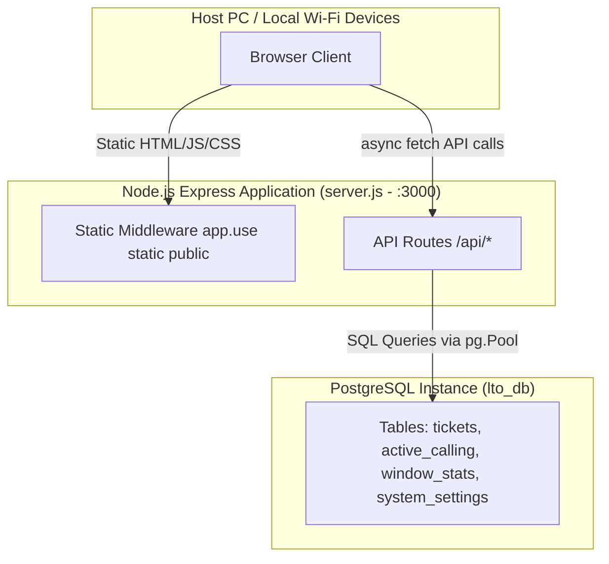

# Express Backend & PostgreSQL Migration Implementation Plan

> **For agentic workers:** REQUIRED SUB-SKILL: Use superpowers:subagent-driven-development to implement this plan task-by-task. Steps use checkbox (`- [ ]`) syntax for tracking.

**Goal:** Build a Node.js Express server with a PostgreSQL database, serving static files on port 3000 (`0.0.0.0`), exposing REST API endpoints, and replacing all `localStorage` calls across the frontend with `fetch()` API calls via `public/js/api.js`.

**Architecture:** Express serves static files from `public/` and routes REST API requests (`/api/*`) to a PostgreSQL database pool (`pg.Pool`). The frontend invokes API endpoints via a central `public/js/api.js` wrapper library using relative URLs.

**Architecture Diagram:**



**Tech Stack:** Node.js, Express, PostgreSQL (`pg`), CORS, dotenv, Vanilla JS (`fetch`), HTML5, CSS3.

## Global Constraints

- **Network Interface:** Express must listen on host `0.0.0.0` port `3000`.
- **CORS & Relative URLs:** Frontend `api.js` must use relative URLs (`/api/...`) to ensure compatibility across local Wi-Fi devices.
- **Database Pool:** Use `pg.Pool` with environment variable configuration (`PGUSER`, `PGPASSWORD`, `PGHOST`, `PGPORT`, `PGDATABASE`).
- **Response Format:** All REST API endpoints must return `{ "success": true, "data": ... }` or `{ "success": false, "error": "..." }`.
- **Preserve Functionality:** Keep DOM IDs, event handling, ticket formatting rules, and render logic intact while migrating storage calls to async `API.*`.

---

### Task 1: Setup Node.js Project, Dependencies, & Database Connection

**Files:**
- Create: `package.json`
- Create: `.env`
- Create: `.env.example`
- Create: `server.js`

- [ ] **Step 1: Create package.json and install dependencies**

Run command in root directory:
```bash
npm init -y
npm install express cors pg dotenv
```

- [ ] **Step 2: Create .env configuration file**

```env
PORT=3000
HOST=0.0.0.0
PGUSER=postgres
PGPASSWORD=postgres
PGHOST=localhost
PGPORT=5432
PGDATABASE=lto_db
```

- [ ] **Step 3: Create server.js with Express & PostgreSQL pool setup**

Implement `server.js`:
- Configure `dotenv`.
- Create `pg.Pool` connection pool.
- Add `app.use(cors())`, `app.use(express.json())`, `app.use(express.static('public'))`.
- Implement `initDb()` to run `CREATE TABLE IF NOT EXISTS` for `tickets`, `active_calling`, `window_stats`, `system_settings`.
- Listen on `PORT` and `HOST`.

- [ ] **Step 4: Verify server startup & DB table creation**

Run: `node server.js`  
Expected: "Server running at http://0.0.0.0:3000" and "Database tables initialized successfully".

---

### Task 2: Implement REST API Endpoints in server.js

**Files:**
- Modify: `server.js`

- [ ] **Step 1: Implement /api/tickets endpoints (GET, POST, PUT, DELETE)**

- `GET /api/tickets`: Query tickets filtering by `status` and `window_id`.
- `POST /api/tickets`: Insert a new ticket record into `tickets`.
- `PUT /api/tickets/:id`: Update ticket `status`, `window_id`, or metadata.
- `DELETE /api/tickets/:id`: Delete a ticket record by ID.

- [ ] **Step 2: Implement /api/calling endpoints (GET, POST, DELETE)**

- `GET /api/calling/:windowId`: Get row from `active_calling` by `window_id`.
- `POST /api/calling/:windowId`: UPSERT active ticket into `active_calling`.
- `DELETE /api/calling/:windowId`: Remove row from `active_calling`.

- [ ] **Step 3: Implement /api/stats & /api/system/pause endpoints**

- `GET /api/stats/:windowId`: Get window stats from `window_stats`.
- `POST /api/stats/:windowId`: UPSERT window stats in `window_stats`.
- `GET /api/system/pause`: Read system pause state from `system_settings`.
- `POST /api/system/pause`: Save system pause state in `system_settings`.

- [ ] **Step 4: Verify API endpoints with curl / node script**

Test API endpoints to verify `{ success: true, data: ... }` responses.

---

### Task 3: Create Frontend API Bridge (public/js/api.js) & Link in HTML Files

**Files:**
- Create: `public/js/api.js`
- Modify: All `public/*.html` files to include `<script src="js/api.js" defer></script>` before page scripts

- [ ] **Step 1: Implement public/js/api.js**

Create `API` helper object wrapping `fetch()` calls:
```javascript
const API = {
    async getTickets(params = {}) {
        const query = new URLSearchParams(params).toString();
        const res = await fetch('/api/tickets' + (query ? '?' + query : ''));
        return await res.json();
    },
    async createTicket(ticket) {
        const res = await fetch('/api/tickets', {
            method: 'POST',
            headers: { 'Content-Type': 'application/json' },
            body: JSON.stringify(ticket)
        });
        return await res.json();
    },
    async updateTicket(id, updates) {
        const res = await fetch('/api/tickets/' + id, {
            method: 'PUT',
            headers: { 'Content-Type': 'application/json' },
            body: JSON.stringify(updates)
        });
        return await res.json();
    },
    async deleteTicket(id) {
        const res = await fetch('/api/tickets/' + id, { method: 'DELETE' });
        return await res.json();
    },
    async getCalling(windowId) {
        const res = await fetch('/api/calling/' + windowId);
        return await res.json();
    },
    async setCalling(windowId, ticketData) {
        const res = await fetch('/api/calling/' + windowId, {
            method: 'POST',
            headers: { 'Content-Type': 'application/json' },
            body: JSON.stringify(ticketData)
        });
        return await res.json();
    },
    async clearCalling(windowId) {
        const res = await fetch('/api/calling/' + windowId, { method: 'DELETE' });
        return await res.json();
    },
    async getStats(windowId) {
        const res = await fetch('/api/stats/' + windowId);
        return await res.json();
    },
    async saveStats(windowId, statsData) {
        const res = await fetch('/api/stats/' + windowId, {
            method: 'POST',
            headers: { 'Content-Type': 'application/json' },
            body: JSON.stringify(statsData)
        });
        return await res.json();
    },
    async getSystemPause() {
        const res = await fetch('/api/system/pause');
        return await res.json();
    },
    async setSystemPause(paused) {
        const res = await fetch('/api/system/pause', {
            method: 'POST',
            headers: { 'Content-Type': 'application/json' },
            body: JSON.stringify({ paused })
        });
        return await res.json();
    }
};
```

- [ ] **Step 2: Update script tags in public/*.html**

Add `<script src="js/api.js" defer></script>` in every HTML file right before the page script tag.

---

### Task 4: Replace LocalStorage Calls in Frontend Scripts

**Files:**
- Modify: `public/js/cashier.js`
- Modify: `public/js/controlPanel.js`
- Modify: `public/js/viewQueuing.js`
- Modify: `public/js/windowA.js` through `public/js/windowN.js`
- Modify: `public/js/windowList.js`
- Modify: `public/js/index.js`
- Modify: `public/js/login.js`

- [ ] **Step 1: Replace localStorage in controlPanel.js & viewQueuing.js**

Refactor `getQueue()`, `saveQueue()`, `togglePause()` to `async/await` using `API.*`.

- [ ] **Step 2: Replace localStorage in windowA.js through windowN.js and cashier.js**

Refactor calling, holding, accomplishing, and stats functions to `async/await` using `API.*`.

- [ ] **Step 3: Replace localStorage in index.js, login.js, and windowList.js**

Replace remaining `localStorage` accesses with `API.*` calls.

---

### Task 5: System Verification & Audit

**Files:**
- Audit: Entire application

- [ ] **Step 1: Audit localStorage occurrences in public/js/*.js**

Verify 0 `localStorage.getItem`, `setItem`, `removeItem` remain (or kept strictly for non-shared UI preferences if any).

- [ ] **Step 2: End-to-End Workflow Verification**

Run `server.js` and verify ticket creation, calling, holding, stats updating, and queue rendering across multiple browser windows.
