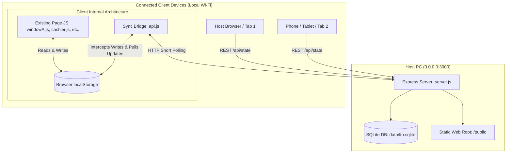

# LTO Multi-Device Wi-Fi Queuing System Implementation Plan

> **For agentic workers:** REQUIRED SUB-SKILL: Use superpowers:subagent-driven-development to implement this plan task-by-task. Steps use checkbox (`- [ ]`) syntax for tracking.

**Goal:** Upgrade the vanilla JS LTO Queuing application into a multi-device local Wi-Fi system using an Express backend on `0.0.0.0:3000`, a persistent SQLite database (`data/lto.sqlite`), and a transparent short-polling sync bridge (`public/js/api.js`) without modifying existing page UI code.

**Architecture:** Express serves static assets from `public/` and exposes REST endpoints alongside a single high-efficiency `GET /api/state` endpoint backed by SQLite. On the frontend, `public/js/api.js` intercepts `localStorage` writes to mirror them to SQLite in the background, while polling `GET /api/state` every 1.5s–2s to synchronize state into `localStorage` safely using write-guards, allowing existing 3-second UI refresh loops to operate seamlessly.

**Architecture Diagram:**

**Tech Stack:** Node.js v24 (`node:sqlite` / SQLite3), Express 5, CORS, Vanilla JavaScript (ES6+).

## Global Constraints
- Do NOT modify any existing page JS logic (`windowA.js`, `cashier.js`, `controlPanel.js`, `viewQueuing.js`, `windowB-N.js`).
- Database must be SQLite (`data/lto.sqlite`), initialized automatically on startup with WAL mode enabled.
- Server must bind to `0.0.0.0:3000` to be accessible on local Wi-Fi.
- Inbound sync must use write-locking (`_isSyncing`) to eliminate infinite recursive write loops.

---

### Task 1: Backend Server & SQLite Data Layer

**Files:**
- Create: `server.js` (rewrite with clean SQLite integration)
- Directory: `data/` (for SQLite database file)

**Interfaces:**
- Produces:
  - `GET /api/state`: `{ success: true, data: { tickets: { queued: [], hold: [], accomplished: [] }, calling: {}, stats: {}, paused: false } }`
  - `POST /api/tickets`: `{ success: true, data: ticket }`
  - `POST /api/tickets/bulk-sync`: `{ success: true, message: 'Sync complete' }`
  - `PUT /api/tickets/:id`: `{ success: true, data: updatedTicket }`
  - `DELETE /api/tickets/:id`: `{ success: true }`
  - `GET /api/calling`, `POST /api/calling/:windowId`, `DELETE /api/calling/:windowId`
  - `GET /api/stats`, `POST /api/stats/:windowId`
  - `GET /api/system/pause`, `POST /api/system/pause`

- [ ] **Step 1: Write backend test script `test/server-endpoints.test.js`**
  - Verify SQLite schema initialization, ticket creation, bulk sync, active calling, and `GET /api/state` response.

- [ ] **Step 2: Run test script to verify failure against current state**
  - Run: `node test/server-endpoints.test.js`
  - Expected: FAIL (table structure / endpoints missing or mismatching)

- [ ] **Step 3: Implement SQLite database schema and Express routes in `server.js`**
  - Use `node:sqlite` / SQLite3 with `PRAGMA journal_mode = WAL;`.
  - Create tables: `tickets`, `active_calling`, `window_stats`, `system_settings`.
  - Implement `/api/state` to return all queue arrays, calling map, stats map, and pause state in a single query.
  - Implement granular REST CRUD handlers for tickets, calling, stats, and settings.
  - Serve `public/` directory statically on `0.0.0.0:3000`.

- [ ] **Step 4: Run test script to verify all endpoints pass**
  - Run: `node test/server-endpoints.test.js`
  - Expected: PASS (all endpoints return 200/201 with expected JSON structures)

---

### Task 2: Frontend Sync Bridge (`public/js/api.js`)

**Files:**
- Modify: `public/js/api.js`

**Interfaces:**
- Consumes: `/api/state`, `/api/tickets`, `/api/calling`, `/api/stats`, `/api/system/pause`
- Produces: Transparent `Storage.prototype.setItem` and `removeItem` hooks; `window.API` helper; background pull sync loop every 1.5s.

- [ ] **Step 1: Write sync bridge unit/integration test `test/api-bridge.test.js`**
  - Test that calling `localStorage.setItem('lto_ticket_queue', ...)` triggers outbound sync.
  - Test that pulling `/api/state` updates `localStorage` without triggering recursive outbound sync.

- [ ] **Step 2: Implement non-destructive `public/js/api.js`**
  - Implement raw `_origSet` and `_origRemove` bindings.
  - Intercept `setItem` for `lto_ticket_queue`, `lto_onhold_queue`, `lto_accomplished_queue`, `lto_*_active_calling`, `lto_stats_*`, `lto_system_paused`.
  - Implement `pullSync()` on `setInterval` (1500ms) fetching `/api/state` and writing into `localStorage` under `_isSyncing = true` protection.
  - Expose clean `window.API` for any direct programmatic calls.

- [ ] **Step 3: Run syntax check and bridge test**
  - Run: `node --check public/js/api.js`
  - Run: `node test/api-bridge.test.js`
  - Expected: PASS

---

### Task 3: HTML Links and Assets Consistency Verification

**Files:**
- Verify: `public/*.html` (all 18 HTML files have `` in correct order before page script)

- [ ] **Step 1: Write verification script to check script tags in all `public/*.html` files**
  - Ensure `js/api.js` is included in `<head>` or before the respective `js/*.js` script.

- [ ] **Step 2: Run verification script and patch any missing HTML script references**
  - Expected: All HTML files properly reference `css/style.css` and `js/api.js`.

---

### Task 4: End-to-End Multi-Window Functional Test

**Files:**
- Test: `test/e2e-scenario.test.js` (Simulate Window A printing ticket -> Window B calling -> Cashier accomplishing)

- [ ] **Step 1: Write E2E simulation test `test/e2e-scenario.test.js`**
  - Simulate Device 1 (Window A): POST new ticket `T-101`.
  - Simulate Device 2 (Window B): Fetch state, verify `T-101` in queue, call ticket, set active calling.
  - Simulate Device 3 (Cashier): Fetch state, verify ticket in Cashier section, mark accomplished.
  - Verify SQLite records match all stage transitions and history log entries.

- [ ] **Step 2: Execute E2E simulation test**
  - Run: `node test/e2e-scenario.test.js`
  - Expected: PASS with all transitions validated.

- [ ] **Step 3: Launch live server and perform live smoke test**
  - Launch `node server.js` on `0.0.0.0:3000`.
  - Verify HTTP access at `http://localhost:3000/index.html` and `http://localhost:3000/api/state`.
