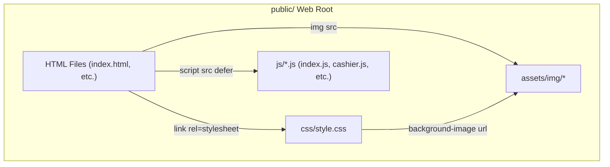

# Project Refactoring Implementation Plan

> **For agentic workers:** REQUIRED SUB-SKILL: Use superpowers:subagent-driven-development to implement this plan task-by-task. Steps use checkbox (`- [ ]`) syntax for tracking.

**Goal:** Refactor vanilla HTML/CSS/JS project into a structured `public/` web root, extract inline CSS and JS into 1:1 standalone files, and update image asset paths.

**Architecture:** All web-servable resources are organized inside `public/`. `.html` files reside in `public/`, stylesheets in `public/css/style.css`, extracted page scripts in `public/js/<page>.js`, and image assets in `public/assets/img/`.

**Architecture Diagram:**



**Tech Stack:** Vanilla HTML5, CSS3, JavaScript (ES6+), PowerShell (file operations / verification).

## Global Constraints

- **Preserve Variable Names & Functions:** Do not rename any JavaScript variables, functions, or DOM IDs.
- **Preserve LocalStorage Keys:** Do not modify any `localStorage.getItem` or `localStorage.setItem` key names.
- **No Inline Code Remaining:** 0 `<style>` tags and 0 inline `<script>` tags in any `.html` file after extraction.
- **Script Attributes:** Use `<script src="js/<filename>.js" defer></script>` for extracted scripts.
- **Stylesheet Link:** Use `<link rel="stylesheet" href="css/style.css">` in `<head>`.

---

### Task 1: Create Directory Structure & Relocate Assets

**Files:**
- Create: `public/`, `public/css/`, `public/js/`, `public/assets/img/`
- Modify: Move `img/*` to `public/assets/img/*`
- Modify: Copy `style.css` to `public/css/style.css`

- [ ] **Step 1: Create public directory hierarchy**

Run command in PowerShell:
```powershell
New-Item -ItemType Directory -Force -Path "public/css", "public/js", "public/assets/img"
```

- [ ] **Step 2: Move image assets to public/assets/img/**

Move all files from `img/` to `public/assets/img/`:
```powershell
Copy-Item -Path "img/*" -Destination "public/assets/img/" -Recurse -Force
```

- [ ] **Step 3: Copy style.css to public/css/style.css**

```powershell
Copy-Item -Path "style.css" -Destination "public/css/style.css" -Force
```

- [ ] **Step 4: Update background image URLs in public/css/style.css**

Ensure any relative image paths in `public/css/style.css` point to `../assets/img/`.

- [ ] **Step 5: Verify folder setup**

Check directory listing of `public/assets/img/` and `public/css/` to confirm files are in place.

---

### Task 2: Refactor Main Pages (index, login, cashier, controlPanel, viewQueuing, windowList)

**Files:**
- Create:
  - `public/js/index.js`
  - `public/js/login.js`
  - `public/js/cashier.js`
  - `public/js/controlPanel.js`
  - `public/js/viewQueuing.js`
  - `public/js/windowList.js`
- Modify:
  - Move and update `index.html` -> `public/index.html`
  - Move and update `login.html` -> `public/login.html`
  - Move and update `cashier.html` -> `public/cashier.html`
  - Move and update `controlPanel.html` -> `public/controlPanel.html`
  - Move and update `viewQueuing.html` -> `public/viewQueuing.html`
  - Move and update `windowList.html` -> `public/windowList.html`
  - Append inline styles to `public/css/style.css`

- [ ] **Step 1: Extract inline JS & CSS from index.html and login.html**

Extract inline JS from `index.html` to `public/js/index.js`.  
Extract inline JS from `login.html` to `public/js/login.js`.  
Update `<head>` stylesheet link to `css/style.css`, update image sources to `assets/img/...`, remove inline `<script>` tags, and add `<script src="js/index.js" defer></script>` and `<script src="js/login.js" defer></script>`.

- [ ] **Step 2: Extract inline JS & CSS from cashier.html, controlPanel.html, viewQueuing.html, windowList.html**

Extract inline `<style>` rules into `public/css/style.css` with page comment headers.  
Extract all inline `<script>` contents into `public/js/cashier.js`, `public/js/controlPanel.js`, `public/js/viewQueuing.js`, and `public/js/windowList.js`.  
Update HTML head and body tags with proper link/script references and image asset paths (`assets/img/...`).

- [ ] **Step 3: Verify core pages**

Check that inline `<style>` and `<script>` tags are removed and JS files are non-empty.

---

### Task 3: Refactor Window Service Pages (windowA through windowN)

**Files:**
- Create: `public/js/windowA.js` through `public/js/windowN.js` (windowA, windowB, windowC, windowD, windowE, windowF, windowG, windowH, windowI, windowJ, windowM, windowN)
- Modify: Move and update `windowA.html` through `windowN.html` into `public/`
- Modify: Append inline window styles to `public/css/style.css`

- [ ] **Step 1: Extract inline JS & CSS from windowA.html through windowN.html**

For each window HTML file (`windowA.html` .. `windowN.html`):
1. Extract inline `<style>` content and append to `public/css/style.css`.
2. Extract all inline `<script>` content sequentially into `public/js/<windowname>.js`.
3. Move HTML file to `public/<windowname>.html`.
4. Update CSS href to `css/style.css`.
5. Replace inline `<script>` tags with `<script src="js/<windowname>.js" defer></script>`.
6. Update any `src="img/..."` attributes to `src="assets/img/..."`.

- [ ] **Step 2: Verify window scripts and styles**

Confirm all `public/js/window*.js` files are generated and contain valid JS code.

---

### Task 4: System-Wide Verification & Cleanup Audit

**Files:**
- Audit: All files in `public/`

- [ ] **Step 1: Verify 0 inline scripts remain in public/*.html**

Run regex check across all `public/*.html` files for inline `<script>` or `<style>` blocks.

- [ ] **Step 2: Audit script & link tags in all HTML files**

Verify every `.html` file contains `<link rel="stylesheet" href="css/style.css">` and `<script src="js/<filename>.js" defer></script>`.

- [ ] **Step 3: Audit image references in all HTML and CSS files**

Ensure all image paths point to `assets/img/` or `../assets/img/`.

- [ ] **Step 4: Confirm task completion**
