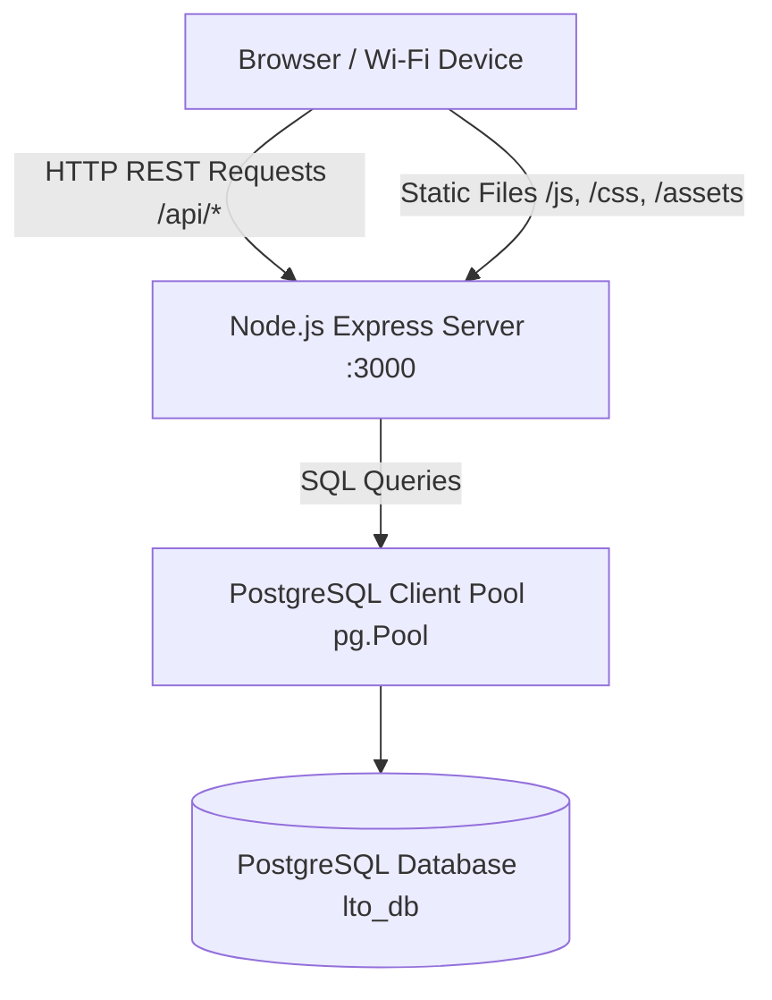

# Design Specification: Node.js Express Backend & PostgreSQL Integration

**Date:** 2026-08-20  
**Status:** Pending Review  
**Scope:** Replace frontend `localStorage` persistence with a Node.js Express backend and PostgreSQL database. Serve static assets over local Wi-Fi (`0.0.0.0:3000`).

---

## 1. System Architecture



---

## 2. Database Schema (`CREATE TABLE IF NOT EXISTS`)

### 2.1 `tickets` Table
```sql
CREATE TABLE IF NOT EXISTS tickets (
    id SERIAL PRIMARY KEY,
    ticket_number VARCHAR(50) NOT NULL,
    transaction_type VARCHAR(100),
    priority_status VARCHAR(50) DEFAULT 'Normal',
    status VARCHAR(50) NOT NULL DEFAULT 'QUEUED', -- ('QUEUED', 'CALLING', 'HOLD', 'ACCOMPLISHED', 'CANCELLED')
    window_id VARCHAR(50),
    metadata JSONB DEFAULT '{}',
    created_at TIMESTAMP DEFAULT CURRENT_TIMESTAMP,
    updated_at TIMESTAMP DEFAULT CURRENT_TIMESTAMP
);
```

### 2.2 `active_calling` Table
```sql
CREATE TABLE IF NOT EXISTS active_calling (
    window_id VARCHAR(50) PRIMARY KEY,
    ticket_number VARCHAR(50),
    ticket_data JSONB,
    called_at TIMESTAMP DEFAULT CURRENT_TIMESTAMP
);
```

### 2.3 `window_stats` Table
```sql
CREATE TABLE IF NOT EXISTS window_stats (
    window_id VARCHAR(50) PRIMARY KEY,
    entries_count INT DEFAULT 0,
    accomplished_count INT DEFAULT 0,
    hourly_data JSONB DEFAULT '[]',
    acc_hourly_data JSONB DEFAULT '[]',
    updated_at TIMESTAMP DEFAULT CURRENT_TIMESTAMP
);
```

### 2.4 `system_settings` Table
```sql
CREATE TABLE IF NOT EXISTS system_settings (
    setting_key VARCHAR(100) PRIMARY KEY,
    setting_value JSONB,
    updated_at TIMESTAMP DEFAULT CURRENT_TIMESTAMP
);
```

---

## 3. Express REST API Endpoints

All responses follow the standard JSON structure: `{ "success": boolean, "data": ... }` or `{ "success": false, "error": "Message" }`.

| Method | Endpoint | Description |
|--------|----------|-------------|
| `GET` | `/api/tickets` | Query tickets by `status` and/or `window_id` |
| `POST` | `/api/tickets` | Create a new ticket |
| `PUT` | `/api/tickets/:id` | Update ticket status, window, or fields |
| `DELETE` | `/api/tickets/:id` | Delete a ticket |
| `GET` | `/api/calling/:windowId` | Get current active ticket for a window |
| `POST` | `/api/calling/:windowId` | Set active calling ticket for a window |
| `DELETE` | `/api/calling/:windowId` | Clear active calling ticket for a window |
| `GET` | `/api/stats/:windowId` | Get statistics for a window |
| `POST` | `/api/stats/:windowId` | Save/Update statistics for a window |
| `GET` | `/api/system/pause` | Get system pause status |
| `POST` | `/api/system/pause` | Set system pause status (`{ paused: boolean }`) |

---

## 4. Frontend API Bridge (`public/js/api.js`)

A central client library exposing clean asynchronous functions:

```javascript
const API = {
    async getTickets(params = {}) { /* fetch('/api/tickets?...') */ },
    async createTicket(data) { /* fetch('/api/tickets', POST) */ },
    async updateTicket(id, data) { /* fetch('/api/tickets/' + id, PUT) */ },
    async deleteTicket(id) { /* fetch('/api/tickets/' + id, DELETE) */ },
    async getCalling(windowId) { /* fetch('/api/calling/' + windowId) */ },
    async setCalling(windowId, data) { /* fetch('/api/calling/' + windowId, POST) */ },
    async clearCalling(windowId) { /* fetch('/api/calling/' + windowId, DELETE) */ },
    async getStats(windowId) { /* fetch('/api/stats/' + windowId) */ },
    async saveStats(windowId, stats) { /* fetch('/api/stats/' + windowId, POST) */ },
    async getSystemPause() { /* fetch('/api/system/pause') */ },
    async setSystemPause(paused) { /* fetch('/api/system/pause', POST) */ }
};
```

---

## 5. LocalStorage Replacement Strategy

- Every page HTML imports `js/api.js` before page-specific JS:
  ```html
  <script src="js/api.js" defer></script>
  <script src="js/cashier.js" defer></script>
  ```
- All functions previously reading/writing `localStorage` (e.g. `getQueue()`, `saveQueue()`, `saveStats()`, `checkPause()`) will be refactored to use `async/await` with `API.*`.
- Render and timer polling functions will be updated to handle Promises gracefully.

---

## 6. Verification Plan

1. **Backend Server Startup:** Verify `server.js` connects to PostgreSQL, creates tables, and serves static files on `0.0.0.0:3000`.
2. **API Endpoint Testing:** Test REST endpoints using `fetch` or HTTP requests.
3. **Frontend Integration:** Test ticket creation, calling, holding, accomplishing, and live refresh across multiple browser windows.
